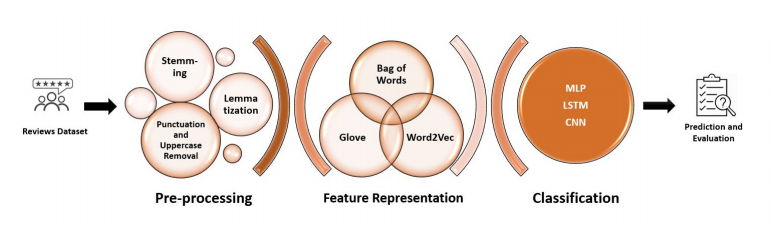

# IMDb-Movie-Reviews-Sentiment-Analysis
Classify and predict reviewers’ sentiments (positive or negative) based on iMDb movies reviews dataset using Python and Keras.

**Data description** 
*  25,000 movie reviews taken from IMDb.
*  2.5k positive and 12.5k negative reviews.
*  Less than 4 stars are negative reviews. More than 7 stars are positive reviews.

**Approach**

Investigate the performances of different types of features for different neural networks.

**Feature representation** 

For feature representation, we used three techniques:
*  **BoW**: Bag of Words,  Each review is modeled as a vector of word count or frequency.
*  **Word2Vec** , **GLoVe**: words are embedded to a new space space based on the word-word co-occurrence. The obtained word vectors exhibit an interesting linear substructure.
    * Word2Vec learns the word vectors by training a 2-layer neural network. 
    * GLoVe learns the word vectors by optimizing a least square objective function. ==> GLoVe training is faster. It still retains the same interesting properties as Word2Vec.
